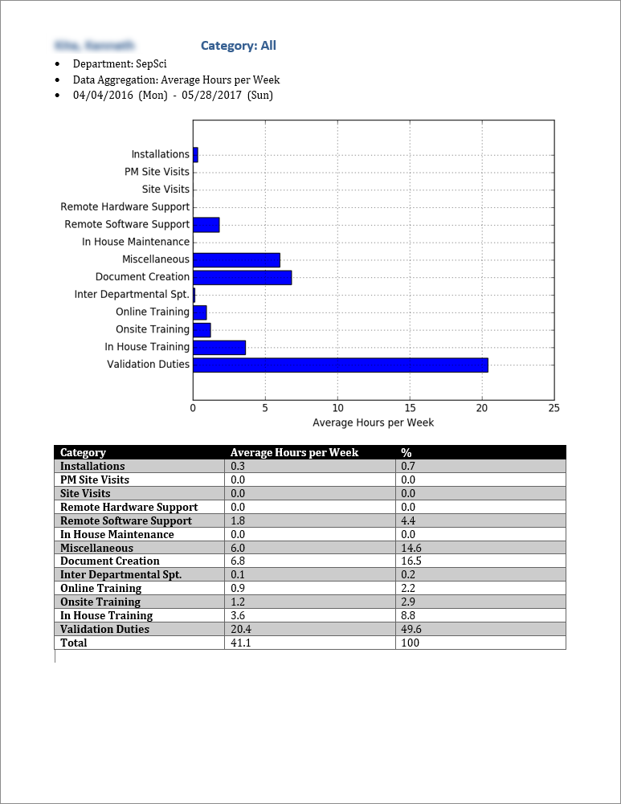

# TimeTrax

*  __Date Written:__ April 2017

*  __Industry:__ Time of Flight Mass Spectrometer Developer & Manufacturer

*  __Department:__ Hardware & Software Customer Support

*  __Application Description:__ The workflow for utilizing this application essentially has three stages
  1.  Team members input their allocated man hours into the data input file, which is a protected excel spread sheet.  At the end of every week, they email the spreadsheet to the service department manager.
  1. The manager uploads the excel files into the SQL database using the GUI which allows for the selection of multiple files at a time.
  1. The GUI allows the manager to define how the database is queried.  After the query conditions are defined and the user clicks the *append report* button the application queries the database as defined by the user.  Then creates the bar graph shown in the Sample Output image files (shown below) using matplotlib.  Finally, the query condition and resulting bar graph are appended to a word document.  Additionally, the data parsed into matplotlib is used to create a table in the word document.  The word document can be any existing word document or the program can generate a new word document.  The file path of the existing or new word document is defined by the user before clicking the append report button.

The GUI also allows the user to add or delete employees from the database or query the database to check if a given employee’s data input file has been uploaded to the database.  This provides the user (manager) a tool to easily track which employees have turned in their data input file.

*  __GUI:__ Below are just a few examples of the features the GUI provides the user.

*  __Sample Raw Data:__
Each member of the service department will fill out this form and email it to the service department manager each week.  Every possible task that a member of the service department team could spend time doing have been broken into 13 categories.  Each category is further sub-divided into 3 to 14 subcategories.  The employee is expected to account for their time during the course of a week.

*  __SQL Database Schema:__

There are 14 total tables: one for each of the 13 categories where each subcategory is a column within the corresponding table.  The last table is an employee information table.

*  __Sample Output:__
An example report when the database was queried for the total man hours spent by the entire service department on each of the 13 categories.

An example report when the database was queried for the total man hours spent by the entire service department on a single category thus the corresponding subcategories are shown.

An example report when the database was queried for the total man hours spent by an individual member of the service department on each of the 13 categories.

An example report when the database was queried for the total man hours spent by an individual member of the service department on a single category thus the corresponding subcategories are shown.

This shows a very small sample of the ways the GUI allows the user to query the database.  Furthermore, you can define the data aggregation method as a summation or an average.  If you select average, you can average the queried data by: day, week, month, quarter, or year.
